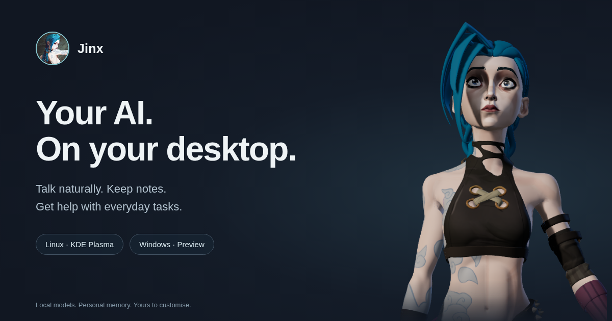

<p align="center"></p>
<h1 align="center">Jinx</h1>
<p align="center"><strong>Your local desktop companion. Talk. Create. Get things done.</strong></p>
<p align="center">Linux · Windows preview · Local AI · Voice · Personal memory</p>


<sub>The owner's custom 3D avatar, rendered for this project. The model is not bundled; choose your own compatible avatar or download the free starter.</sub>

### Download & install

| Your system | Download | Start here |
|---|---|---|
| **CachyOS / Arch · KDE Plasma 6** | [**Download Linux ZIP**](https://github.com/DexterouZs/jinx-desktop/releases/download/v0.2.0-preview/Jinx-0.2.0-preview-linux.zip) | Extract, then run `bash "Install Jinx.sh" --install-deps` |
| **Windows 11 · x64** | [**Download Windows installer**](https://github.com/DexterouZs/jinx-desktop/releases/download/v0.2.0-preview/Jinx-0.2.0-preview-windows-x64-setup.exe) | Run the installer, open Jinx, then follow Settings → Get Ollama |

**[Download Jinx →](https://github.com/DexterouZs/jinx-desktop/releases)** · [Linux setup](docs/INSTALL.md) · [Windows setup](docs/WINDOWS.md)

Both editions are previews. **Windows is a smaller native port**, with chat, voice, memory, basic app/website launches and an avatar view. Linux has the established animated desktop widget and broader integrations described below. Windows does not yet include the Linux system-admin, calendar, screen, continuous-conversation or cloned-voice features.

Models download separately. Linux's full setup needs roughly 13 GB of model storage; the Windows everyday model needs roughly 3–4 GB, plus the app and speech model. **Jinx starts only when you launch her.** No personal accounts, memories or API keys are included.

On an existing Linux installation, use `--update` only when you intend to update it. The installer preserves private data and creates a previous-app backup. [Installation and recovery →](docs/INSTALL.md)

### Linux features

| Capability | How it works |
|---|---|
| Natural conversation | Click once, speak, pause, listen; English replies with English/German recognition |
| Local intelligence | Fast Qwen 4B for everyday replies; Qwen 27B for tool work and harder requests |
| Desktop companion | Transparent native Qt window, 3D animation, speech captions, size/position controls |
| Personal memory | Local SQLite facts and saved research; review, correct or delete them |
| Web assistance | Open websites, find YouTube videos, research sources and cite links |
| Everyday tools | Timers, calculations, notes, app launches and local Spotify controls |
| Calendar | Optional Morgen connection; supported changes require exact read-back and confirmation |
| Writing | Draft useful text and save unsent email files |
| Desktop administration | Inspect system state and logs; bounded terminal tools and reviewed installation flow |
| Home integrations | Optional Home Assistant and privately configured service reachability |

Try “Open Firefox”, “Remember that I prefer short answers”, “Show me today's news”, or “Use the big model and think carefully about this”. Selecting 27B alone does not force extended reasoning.

### Your data belongs on your device

- No credentials, conversation history, personal contacts or household network configuration are included in this repository or release ZIP.
- Microphone/wake-word listening is opt-in; explicit screen reading shows a visible indicator.
- Web searches and optional connected services send requests to their providers. “Local AI” does not make those integrations offline.
- Messages and calendar changes retain their application confirmation flow. Shell access runs with your user permissions and a denylist; **it is not a security sandbox**.
- The installer does not tune your kernel, fans, sleep, power profiles or NPU driver.

### Avatar and voices

Fresh installations use a British Piper voice and an optional Ready Player Me starter avatar. The starter avatar is **CC BY-NC 4.0, personal/non-commercial use**. The application's code license does not override asset licenses.

Personal character models and voice recordings are not distributed through GitHub. A private NAS restoration ZIP may include a `personal-assets/` folder which the installer imports locally. Breeze/F5 cloning remains an advanced optional integration requiring its separate model/runtime files. Existing configured voices are preserved during an update. [Assets and attribution →](docs/ASSETS.md)

### What to expect

27B can take tens of seconds from a cold start on a low-power profile. All model layers already use the GPU on the tested Z13. NPU and GPU inference cannot simply be added together for this model. The current NPU path is optional/experimental; CPU recognition is the default after an observed driver hang.

External app interfaces can change. Spotify named-track selection, ZapZap sending and optional account integrations need a configured, logged-in application and may require follow-up. A successful app launch is not proof that a game loaded; an email draft is not a sent message. News selection follows configured publisher feeds, not an objective ranking of global importance.

### Development

The Python backend and native Qt/Three.js avatar remain modular internally, while the installer presents one application. [Architecture →](docs/ARCHITECTURE.md) · [Contributing →](CONTRIBUTING.md) · [Security →](SECURITY.md)

```bash
python3 install.py --prepare-only /absolute/path/to/new-build
cd /absolute/path/to/new-build
.venv/bin/python -m unittest test_adaptive test_task_guard test_news_briefing
```

Original code is MIT. Jinx character artwork is fan artwork, not covered by the code licence; no rights to the character are claimed. See [LICENSE](LICENSE) and [third-party notices](docs/ASSETS.md). No affiliation with Riot Games, Anuttacon, AMD, Valve or the providers of optional integrations.
