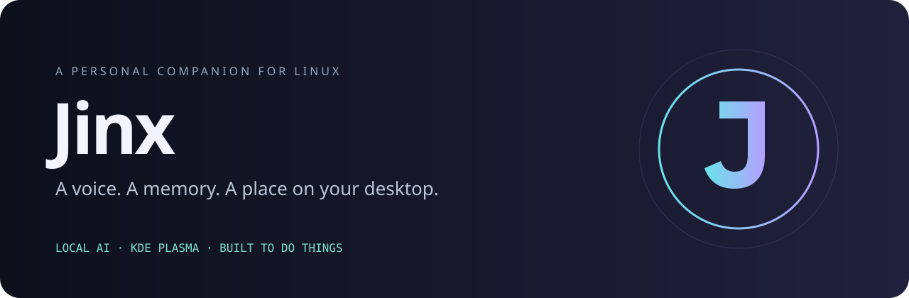
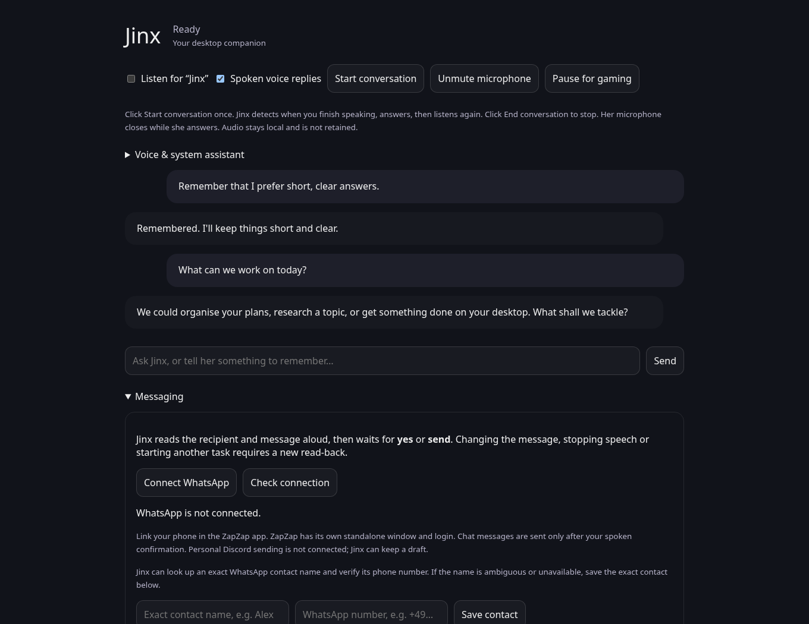

<p align="center"></p>

<p align="center"><strong>A voice-enabled desktop assistant that remembers, researches and helps you get things done.</strong></p>
<p align="center">Linux · KDE Plasma 6 · Local Qwen models · Optional connected services</p>

Jinx lives on your desktop as a small animated companion. Click to talk, pause naturally, hear her answer, and continue the conversation. Click again to stop. Her memory stays on your SSD, and her tools can open applications, research websites, prepare drafts and handle supported everyday tasks.


<sub>Actual workspace interface, shown with synthetic demonstration data.</sub>

**Early preview — CachyOS/Arch on KDE Wayland.** Developed and tested on an AMD Ryzen AI MAX+ 395 / Radeon 8060S laptop. This is an installable application bundle, not a universal AppImage or a guarantee that every task works on every Linux desktop.

### Get started

Download the ZIP from [Releases](https://github.com/DexterouZs/jinx-desktop/releases), extract it, and run:

```bash
bash "Install Jinx.sh" --check
bash "Install Jinx.sh" --install-deps
```

Then open **Jinx** from the application menu. No AI service is enabled at login. The installer builds the native desktop interface, installs an isolated Python environment and downloads the selected models. **Allow approximately 13 GB for the full language models, plus dependencies and speech assets. Internet is required during installation.** Existing model files are reused.

Already installed? Use `--update` to preserve the previous application in an installer backup. Your memory, private service connections and settings remain separate. [Installation and recovery →](docs/INSTALL.md)

### What she can do

| Capability | How it works |
|---|---|
| Natural conversation | Click once, speak, pause, listen; English replies with English/German recognition |
| Local intelligence | Fast Qwen 4B for everyday replies; Qwen 27B for tool work and harder requests |
| Desktop companion | Transparent native Qt window, 3D animation, speech captions, size/position controls |
| Personal memory | Local SQLite facts and saved research; review, correct or delete them |
| Web assistance | Open websites, find YouTube videos, research sources and cite links |
| Everyday tools | Timers, calculations, notes, app launches and local Spotify controls |
| Calendar | Optional Morgen connection; supported changes require exact read-back and confirmation |
| Writing | Draft useful text and save unsent email files |
| Desktop administration | Inspect system state and logs; bounded terminal tools and reviewed installation flow |
| Home integrations | Optional Home Assistant and privately configured service reachability |

Try “Open Firefox”, “Remember that I prefer short answers”, “Show me today's news”, or “Use the big model and think carefully about this”. Selecting 27B alone does not force extended reasoning.

### Your data belongs on your device

- No credentials, conversation history, personal contacts or household network configuration are included in this repository or release ZIP.
- Microphone/wake-word listening is opt-in; explicit screen reading shows a visible indicator.
- Web searches and optional connected services send requests to their providers. “Local AI” does not make those integrations offline.
- Messages and calendar changes retain their application confirmation flow. Shell access runs with your user permissions and a denylist; **it is not a security sandbox**.
- The installer does not tune your kernel, fans, sleep, power profiles or NPU driver.

### Avatar and voices

Fresh installations use a British Piper voice and an optional Ready Player Me starter avatar. The starter avatar is **CC BY-NC 4.0, personal/non-commercial use**. The application's code license does not override asset licenses.

Personal character models and voice recordings are not distributed through GitHub. A private NAS restoration ZIP may include a `personal-assets/` folder which the installer imports locally. Breeze/F5 cloning remains an advanced optional integration requiring its separate model/runtime files. Existing configured voices are preserved during an update. [Assets and attribution →](docs/ASSETS.md)

### What to expect

27B can take tens of seconds from a cold start on a low-power profile. All model layers already use the GPU on the tested Z13. NPU and GPU inference cannot simply be added together for this model. The current NPU path is optional/experimental; CPU recognition is the default after an observed driver hang.

External app interfaces can change. Spotify named-track selection, ZapZap sending and optional account integrations need a configured, logged-in application and may require follow-up. A successful app launch is not proof that a game loaded; an email draft is not a sent message. News selection follows configured publisher feeds, not an objective ranking of global importance.

### Development

The Python backend and native Qt/Three.js avatar remain modular internally, while the installer presents one application. [Architecture →](docs/ARCHITECTURE.md) · [Contributing →](CONTRIBUTING.md) · [Security →](SECURITY.md)

```bash
python3 install.py --prepare-only /absolute/path/to/new-build
cd /absolute/path/to/new-build
.venv/bin/python -m unittest test_adaptive test_task_guard test_news_briefing
```

MIT for original application code; see [LICENSE](LICENSE) and [third-party notices](docs/ASSETS.md). No affiliation with Riot Games, Anuttacon, AMD, Valve or the providers of optional integrations.
